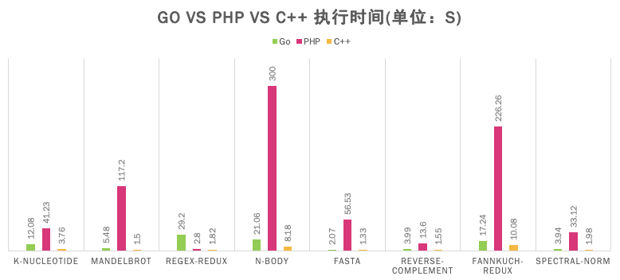
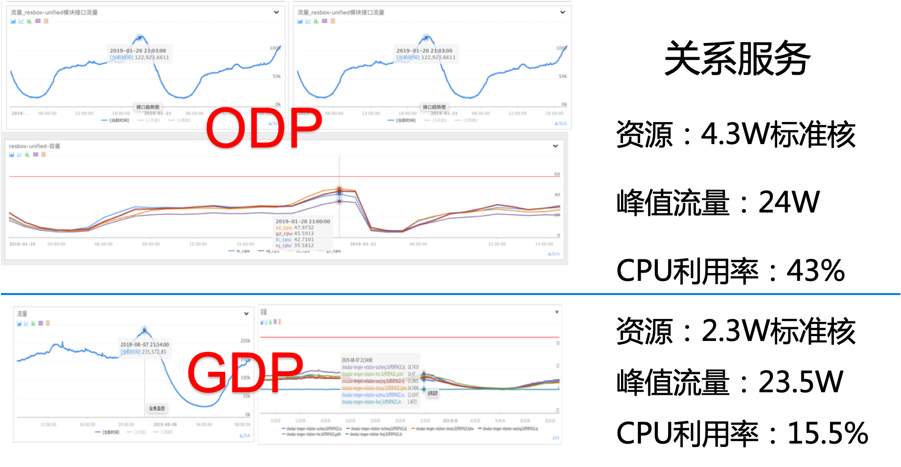
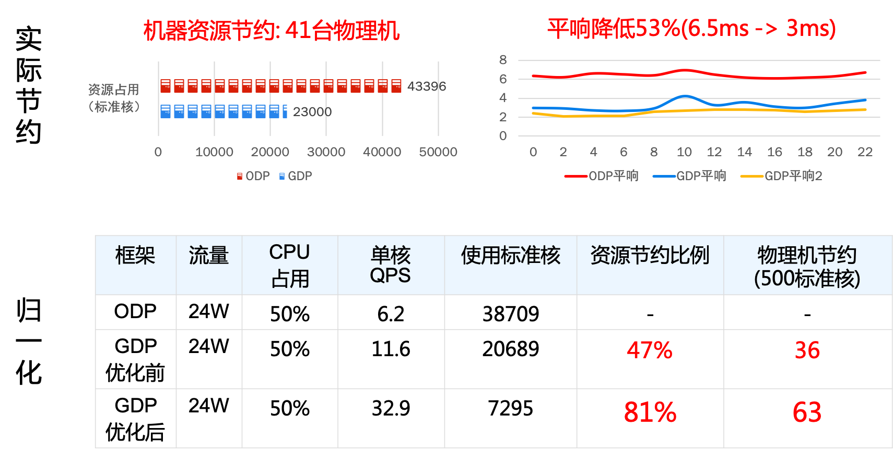
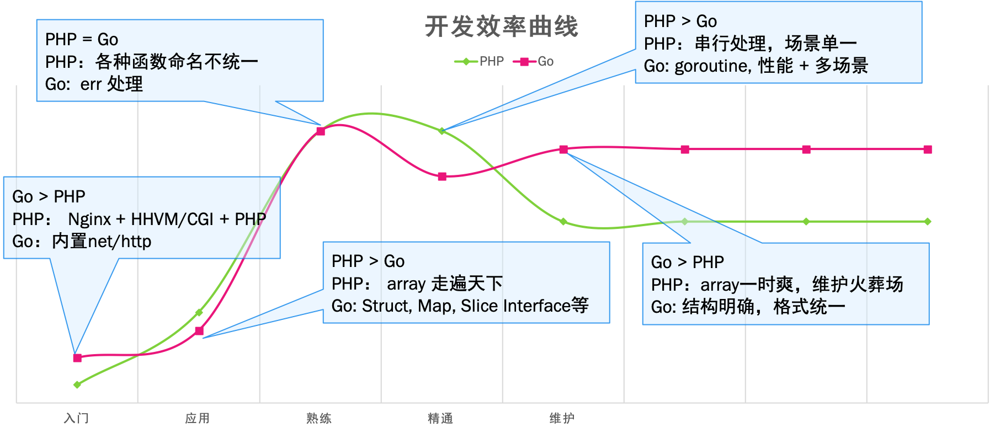
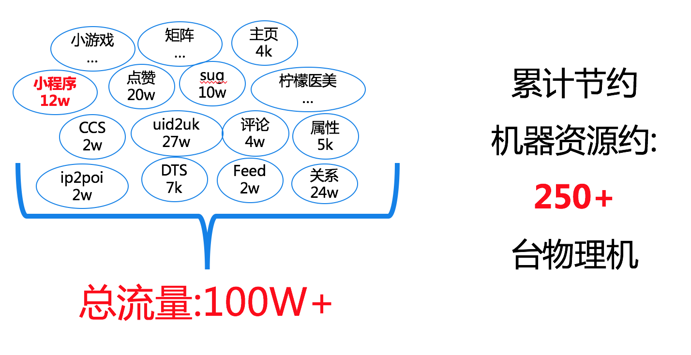
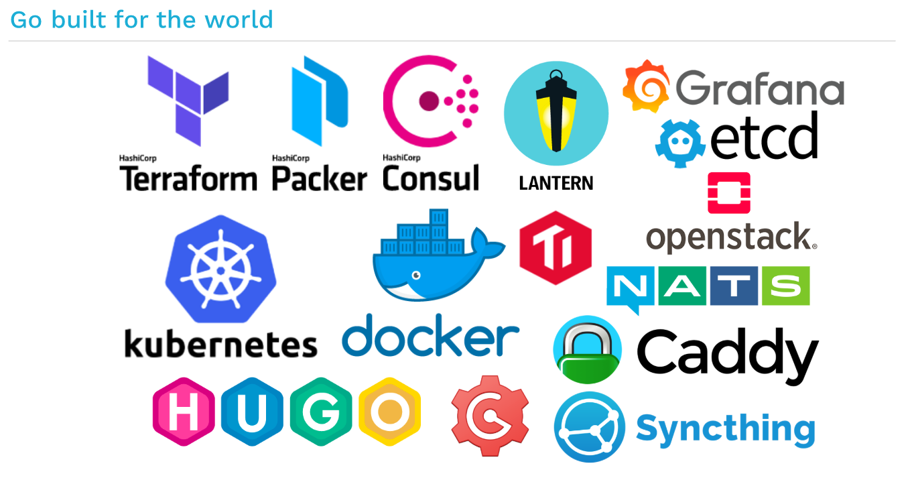

Go VS PHP 利弊分析

# 摘要:
Go 相对 PHP 的优点:

1. **性能及资源占用:** Go 在 CPU密集型和 IO 密集型情况下绝大部分场景比 PHP要好很多， 绝大多数目前的服务可以节约 60% 以上的资源
2. **可维护性:** Go 语言可读性好，规范明确，可维护性高于 PHP
3. **生态:** Go 语言生态要比 PHP 丰富很多，而且很多是官方提供，更加有保障
4. **开发人员成长空间：** Go 要高于 PHP。 PHP 语言局限，天花板低，深度需要用 C 来解决; Go 更加全面。
5. **对公司未来发展:** 云原生时代要对底层有把控，必须要能了解 Go 语言。微服务话需要更加底层的协议支持，PHP支持不了。

Go 相对 PHP 的缺点:

1. **开发效率:** Go 语言在业务开发常见场景中略低于 PHP 大概 10%左右
2. **安全性：** PHP 高于 Go
3. **对开发人员的要求:** Go 要高于 PHP

# 结论: Go 取代 PHP 是大势所趋
1. 如果是新项目建议应该**优先选择**使用 Go 语言
2. **长线看**，如果有人力、且重构**成本可接受**，建议逐步重构 PHP 项目为 Go 项目
3. 掌握 Go 语言在云原生时代有非常大的优势

# 1 语言对比
## 1.1 性能
### 1.1.1 CPU 密集型性能对比:

数据来源: [https://benchmarksgame-team.pages.debian.net/benchmarksgame/](https://benchmarksgame-team.pages.debian.net/benchmarksgame/)

### 1.1.2 IO密集型性能对(关系服务线上数据)

## 1.2 资源利用
以关系服务重构前后的线上数据对比举例：

## 1.3 开发效率
以两中语言都是用过的经验为依据：

**PHP 用户吐槽 Go 最影响效率的点:**

**1 每次调试都要编译，等待编译时间:**

这就是动态脚本语言与编译型语言的区别，无法改变。

PHP 程序员一般通过在代码中加一些打印函数来 debug, 并且在 Go 语言中也这么用。这种效率比较低，建议利用 Go 语言专门的 debug 工具，通过断点方式提高效率

可以通过热变异的方式每次修改代码后自动编译，Go 语言本身编译很快，可以尽量减少编译等待时间。

**2 json 解析 PHP 什么都不用管， Go 则需要先定义一个数据结构:**

对于复杂的数据类型确实比较麻烦，为了提高编写效率可以使用一些自动转换工具: [https://mholt.github.io/json-to-go/](https://mholt.github.io/json-to-go/)

定义数据类型类型优点: 结构明确，后期维护效率高；更加安全，防止端上由于数据类型导致的崩溃

## 1.4 周边生态

结论:
Go 语言生态更加丰富，官方自带功能丰富，使用方便
PHP 生态集中在web开发，实际使用的不多，使用成本高

||Go|PHP|备注|
|-|-|-|-|
|依赖管理|glide, godeps, gopkg, GOD, Go Module|composer|PHP 真正使用的人很少，都是 COPY 的方式Go Proxy 已经建立，官方 Go Module 正在快速发展|
|WEB框架|https://github.com/avelino/awesome-go#web-frameworks40个左右|https://github.com/ziadoz/awesome-php#frameworks10个|Go 大部分的 WEB 框架都是基于标准库 net/http, 只是做一些路由和中间件机制PHP 大部分 WEB 框架只是路由和autoload class|
|RPC 框架|gRPC-gorpcxhprose-golang|grpc C 扩展hprose-php|PHP 受制于语言的限制，无法实现一个纯 PHP 的 rpc 框架，只能是通过 C扩展的方式来做，这样开发难度和维护成本都比较高|
|代码检查|https://github.com/avelino/awesome-go#code-analysis|https://github.com/ziadoz/awesome-php#code-analysishttps://github.com/ziadoz/awesome-php#code-qualityhttps://github.com/ziadoz/awesome-php#architectural|PHP 虽然有很多代码检查工具，但是学习和使用成本比较高，一般工作中使用的并不多，所以会导致 PHP 代码维护起来比较困难。 Go 语言自带很多检查工具，而且有些规范是强制的，所以 Go 语言代码要清晰很多，便于阅读和维护|
|开发测试|https://github.com/avelino/awesome-go#utilities|https://github.com/ziadoz/awesome-php#debugging-and-profiling|PHP 的调试一般都是通过 print 方式，需要不断的修改代码Go 的调试可以使用 print 但是更建议使用 dlv 的工具短点调试，Go 的调试需要编译，虽然 Go 的编译很快，但是相对 PHP 来说还是有些麻烦|
|单元测试|https://github.com/avelino/awesome-go#testing|https://github.com/ziadoz/awesome-php#testing|PHP 的单元测试工具不是太好用，使用也比较麻烦，对于一些情况无法 mock，无法写单元测试Go 自带单元测试工具，测试规范也比较明确，基本不存在无法写单元测试的情况，但对于一些并发测试没有更好的方法|
|页面渲染|Go 语言自带模板https://github.com/avelino/awesome-go#template-engines|https://github.com/ziadoz/awesome-php#templating|Go 语言用自带模板多PHP 用 smarty 多大多数人习惯了 smarty, 学习新的模板需要一些成本|

数据来源:
[https://github.com/ziadoz/awesome-php](https://github.com/ziadoz/awesome-php)
[https://github.com/avelino/awesome-go](https://github.com/avelino/awesome-go)

## 1.5 其它对比
|对比项|Go|PHP|结论|
|-|-|-|-|
|安全性|Go 对底层有更高的控制权限，风险也更高Go 的goroutine 都是平级的，如果使用不当会导致整个程序崩溃，可以通过规范，CR, 代码检查，封装更加安全的用法来保证Go 程序由于是单进程一直运行，可能会存在内存泄露的情况|1. PHP 运行模式是单进程模式，单个进程挂到不影响其它的进程2. PHP 每个请求运行完会主动释放内存，不存在内存泄露问题3. PHP 的高级功能都需要依赖扩展实现，扩展是 C 写的，开发效率低，开发难度大，不好维护，也存在一些安全性问题，但是无法控制。|PHP 比 Go 更加安全|
|上线|Go 程序需要重启才能上线，所以需要停止服务，目前依赖 BNS摘除 + PaaS 控制时间来保证线上是分级部署，上线时间需要 1小时左右|1. PHP 是脚本语言，可以单独文件上线不影响程序运行2. 目前 PaaS 平台潘多拉是批量软链方式升级版本，对服务有损，正在改进，尽量减少有损时间3. orp 需要十几分钟就可以上线，潘多拉如果才去停机上线需要2个小时，潘多拉如果适配PHP 服务后可以跟 ORP 一致|PHP 比 Go 上线更快|
|学习成本|1. 语法 Go 很简单2. Go 的一些高级特性对人员素质要求较高|PHP 语法很简单PHP 内部明明混乱，编码规范不清晰，可读性差PHP 只是针对 WEB开发，特性较少，容易掌握但是范围比较局限|各有利弊， 势均力敌|
|语言能力|Go 语言作为一个更加通用型的语言可以实现:方便的实现并发控制语言能力看齐 C/C++, 可以调用很多底层功能语言可以支持多种交互协议|PHP 作为专门为WEB开发而生的语言：能力集中在业务逻辑开发高级的功能需要通过C扩展的形式，开发难度大，维护成本高依赖WEB服务器+ CGI管理，只支持HTTP协议|Go 比 PHP 可做更多的事情|

# 2 GDP 业务使用状态
## 2.1 团队内部使用情况

## 2.2 MEG 其他团队使用情况
|团队|业务|业务形态(HTTP服务 / RPC服务 / 离线脚本)|目前使用语言|业务痛点(资源占用 / 开发效率 / 维护成本)|是否可以使用go解决|使用 GDP 的需求|开发计划|
|-|-|-|-|-|-|-|-|
|赵林 / 贴吧|1.词表服务(4w qps)2.User服务(14w qps)A.基础数据B.扩展数据C.用户关注3.Forum服务(14w qps)A.吧目录B.吧属性C.吧操作4.Push服务A.Push ServerB.APNSC.Android-pushD.IM-pusherE.push-prepare(离线)5.图片上传A.IMG-cmB.IMG-meta|HTTP服务|PHP/C++(APNS)|PHP资源占用多C模块(APNS)开发效率低|是|支持 HTTP Server支持 RAL支持 Redis支持 DDBS支持 Memcache支持 Conf支持 日志|1.词表服务完成重构 2.User服务开发完成，正在测试和上线 3.Forum服务开发完成，正在测试和上线 4.Push服务的Push Server、APNS、Android-push、push-prepare完成重构；IM-pusher正在开发 5.图片上传\浏览完成重构，线上小流量|
|廖迪青/feed架构|1.商鞅词典平台2.摩天轮离线计算平台|HTTP服务|go|常驻进程，调度系统，大量状态信号，网络通信，并发监控，有work端与 master端的网络通信，需要多协程能力|是|相关基础库，目前GDP已支持|已在线上使用|
|黄千/网盟|在线实时拼图服务，主要用于开屏广告的实时渲染拼图|HTTP服务|go|选择go主要原因是对于图像处理有丰富简单的处理能力，开发效率高。网络服务器能力较好，能够快速构建高效的http服务。|是|支持 HTTP Server支持 Conf支持 日志支持 CDN|已在线上使用|
|黄千/网盟|在线广告模板渲染服务|RPC服务|nodejs|开发迭代效率高支持丰富的模板处理库高效率的网络框架|是|支持 RPC Server支持 protobuf支持 Conf支持 日志支持 Redis支持 MySQL|已在线上使用|

## 2.3 公司内使用情况

# 3 替换建议
## 3.1 替换要考虑的因素
ps: 下面的建议每项都是一个参考点，如果同时命中不同的指标但是建议不一致，可以根据自己的业务优先级进行选择

|指标|替换建议 （✅ 建议替换 ❌ 不建议替换）|
|-|-|
|开发频率|❌ 迭代速度快，没有时间重构✅ 迭代速度适中，可以留出重构时间❌ 基本不迭代，处于维护期|
|业务流量+ 资源占用|
✅ 业务流量大/小 + 资源占用多❌ 业务流量大/小 + 资源占用少|
|新业务|✅ 有 Go 知识储备✅ 无 Go 知识储备 + 需求排期宽松❌ 无 Go 知识储备 + 需求排期紧急，特别是倒排|
|维护成本|❌ 业务复杂，重构成本高，但是可以很好的维护✅ 业务复杂，重构成本高，但是维护成本也非常高，不敢动原来的代码✅ 业务逻辑简单，重构成本低✅ 不同团队代码耦合严重，逻辑分支多，维护成本很高|
|架构|❌ 架构依然能够维持业务的发展✅ 架构老旧，需要迭代更新才能满足业务发展✅ 架构老旧，不适用于现在的公司云原生和微服务的发展规划|
|前后端分离|✅ 对于前后端分离的可以放心替换❌ 前后端没有分离，FE 不愿意更换模板|

## 3.2 替换建议

1. 代码库粒度要划分清楚，最好是每个独立的业务独立一个代码库
2. 对于公共库的部分要做到与业务无关，并且大家共同维护，防止重复开发
3. 同一个业务的相同逻辑只出现一份，不要出现两种不同语言的相同逻辑 （替换期间可以共存，但是绝不是最终状态）
4. 对外输出的方式尽量选择语言无关的 RPC/HTTP 服务，不要使用SDK 的方式

# 4 Go语言是云原生时代的语言
1. CNCF 中许多核心项目都是 Go 语言编写的
2. 微服务话会带来服务之间调用的复杂性，单纯的 HTTP 协议已经不能满足需求，需要更多 RPC 协议的支持，而 PHP 适用的业务场景也在缩小。

[https://spf13.com/presentation/what-should-a-modern-practical-programming-language-look-like/](https://spf13.com/presentation/what-should-a-modern-practical-programming-language-look-like/)

