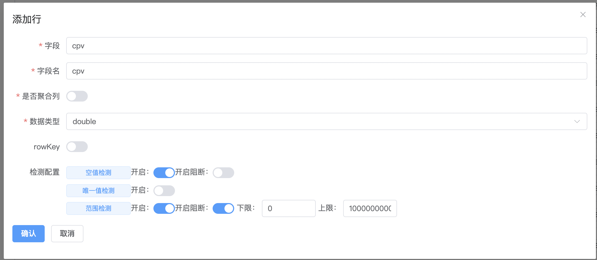

搜索通用DQC能力建设

#### 一、背景
当前 tds 任务缺少业务相关指标核验保障，产出数据无校验直接上线报表，数据存在异常时无法及时发现，数据上线后对线上有极大影响。本期提供数据质量检测通用能力，支持数据同环比异常、异常情况任务阻断、异常预警相关能力。


#### 二、设计
一期针对 ads 层进行 DQC 建设


##### 1.数管平台 schema 管理
平台页面：

schema 管理：

参考维表管理


json demo：

```
{
  "order": [
    "query",
    "plan_id",
    "query_1st_category",
    "query_2nd_category",
    "material_id",
    "sid"
  ],
  "properties": {
    "material_id": {
      "title": "物料id",
      "type": "string",
      "rule":"distinct:1;nullcheck:0"
    },
    "plan_id": {
      "title": "计划id",
      "type": "string"
    },
    "query": {
      "title": "query",
      "type": "string"
    },
    "query_1st_category": {
      "title": "query一级行业分类",
      "type": "string"
    },
    "query_2nd_category": {
      "title": "query二级行业分类",
      "type": "string"
    },
    "sid": {
      "title": "实验id",
      "type": "string"
    },
    "count": {
      "title": "累加",
      "type": "int",
      "rule":"range:1&gt:0.05&lt:10000;distinct:1;nullcheck:0"
    }
  },
  "required": [
    "query",
    "plan_id",
    "query_1st_category",
    "query_2nd_category",
    "material_id",
    "sid"
  ]
}
```


tds demo：

1.新建本地任务执行，配置通用模板算子


2.配置输入路径、ugi 以及平台上的 schema_id，任务会读取对应 schema 及校验规则进行 DQC 校验。


报警：

支持群报警（强 / 弱规则），分析异常原因


#### 三、功能点
产出检测

1、阈值，~~波动~~，唯一，空值，~~同环比~~

2、阻断开关：强规则（空数据等），弱规则（波动等）

3、检测模型（调研）AR 自回归，谐波季节模型 + PCA；待定

前置检测

4、~~血缘质量检测~~

预警能力

5、预警通知（通用能力）

* 弱规则异常通知，分析
* 强规则阻断告警


#### 四、接口
**1.前端 schema 表单提交**

**请求方式**

Method: POST

Endpoint: /dqc/schema/upload

**请求头**

|Header|Value|Required|
|-|-|-|
|Content-Type|application/json||
|Authorization|...||
|Language|...||

**请求参数**

body：

```
{
  "order": [
    "query",
    "plan_id",
    "query_1st_category",
    "query_2nd_category",
    "material_id",
    "sid"
  ],
  "properties": {
    "material_id": {
      "title": "物料id",
      "type": "string",
      "rule":"distinct:1;nullcheck:0"
    },
    "plan_id": {
      "title": "计划id",
      "type": "string"
    },
    "query": {
      "title": "query",
      "type": "string"
    },
    "query_1st_category": {
      "title": "query一级行业分类",
      "type": "string"
    },
    "query_2nd_category": {
      "title": "query二级行业分类",
      "type": "string"
    },
    "sid": {
      "title": "实验id",
      "type": "string"
    },
    "count": {
      "title": "累加",
      "type": "int",
      "rule":"range:1,gt:0.05,lt:10000;nullcheck:0"
    },
    "count1": {
      "title": "累加1",
      "type": "int",
      "rule":"range:1,gt:0.5,lt:2000;nullcheck:0"
    },
    "value_cnt": {
      "title": "累加",
      "type": "int",
      "composite": "true",
      "formula":"(count + count1) / count1"
      "rule":"range:1,gt:0.05,lt:10000;nullcheck:0"
    }
  },
  "distinct": [
    "query",
    "plan_id",
    "query_1st_category",
    "query_2nd_category",
    "material_id",
    "sid"
  ]
}
```


参数说明：

|规则字段|中文名|传参 demo|
|-|-|-|
|range|阈值|range:1,gt:0.05,lt:10000|
|distinct|去重|distinct:1；1 代表异常时 block 上线|
|nullcheck|空值|nullcheck:0；1 代表异常时 block 上线|
|distinct|去重校验|重复值校验，传需要组合校验的字段维度："distinct": [
    "query",
    "plan_id",
    "query_1st_category",
    "query_2nd_category",
    "material_id",
    "sid"
  ]|


**2.获取 schema**

**请求方式**

Method: GET

Endpoint: /dqc/schema/show

**请求头**

|Header|Value|Required|
|-|-|-|
|Content-Type|application/json||
|Authorization|...||
|Language|...||

**请求参数**

|字段|类型|含义|是否必填|
|-|-|-|-|
|schema_id|int|平台 schema id|是|

```
{
    "code": 200,
    "message": "success",
    "data": {
        "order": [
            "query",
            "plan_id",
            "query_1st_category",
            "query_2nd_category",
            "material_id",
            "sid"
        ],
        "properties": {
            "material_id": {
                "title": "物料id",
                "type": "string",
                "rule": "distinct:1;nullcheck:0"
            },
            "plan_id": {
                "title": "计划id",
                "type": "string"
            },
            "query": {
                "title": "query",
                "type": "string"
            },
            "query_1st_category": {
                "title": "query一级行业分类",
                "type": "string"
            },
            "query_2nd_category": {
                "title": "query二级行业分类",
                "type": "string"
            },
            "sid": {
                "title": "实验id",
                "type": "string"
            },
            "count": {
                "title": "累加",
                "type": "int",
                "rule": "range:1;range_value_gt:0.05;range_value_lt:100;distinct:1;nullcheck:0"
            }
        },
        "required": [
            "query",
            "plan_id",
            "query_1st_category",
            "query_2nd_category",
            "material_id",
            "sid"
        ]
    }
}
```


todo

1.schema 导入优化

* 从 palo 里获取 schema，解析 schema & 配置规则
* 表单提交
* json 提交

⚠️ ck 目前不支持 api，无法获取 schema；若需校验通过表单 & json 提交


#### 五、使用手册
地址：[https://sdata.baidu-int.com/dqc/list](https://sdata.baidu-int.com/dqc/list)

一、添加数据


二、配置 schema


三、字段检测规则配置


四、tds 任务配置

配置本地执行算子

发布产出：wget -O output.tar.gz --no-check-certificate --header "IREPO-TOKEN:9e5d1a42-0499-45a1-938f-0a78caf43e4d" "[https://irepo.baidu-int.com/rest/prod/v3/baidu/search/turing_data/releases/1.0.596.1/files](https://irepo.baidu-int.com/rest/prod/v3/baidu/search/turing_data/releases/1.0.596.1/files)"

算子目录：dpc_capacity_building

参数配置：afs地址、ugi、schemaid


五、配置群报警

支持选择群报警机器人及群号


报警形式：

