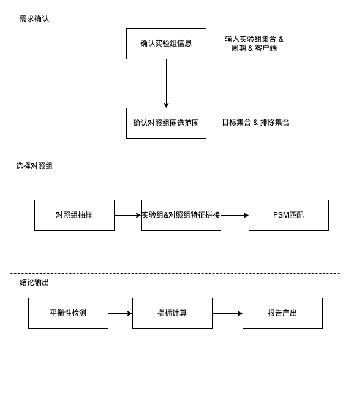
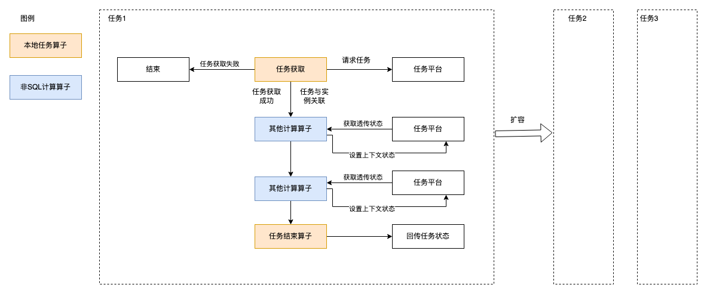
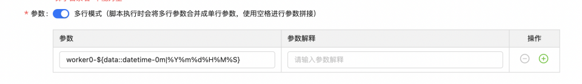
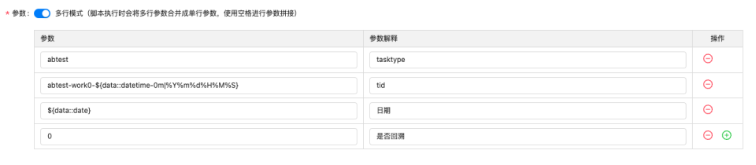

数据科学平台化

# **一、背景**
产研数据团队承接了许多数据需求分析的需求，诸如ROI，虚拟AB，这些需求大部分是共性的需求，可以通过通用的流程进行固化，供PM自助分析。同时可以将人力解放出来，去探索更多的数据价值。平台的一部分目标是将数据价值的部分进行平台化，一期预期平台化的部分是虚拟AB实验部分

# 二、课题
## 2.1、虚拟AB实验

整个虚拟AB实验可以抽象成上面的流程。从平台设计上面上，可以将流程进一步抽象成任务提交以及任务执行两个步骤

任务管理的几种可能方式：

### 1）复用TDS平台
TDS启动例行任务（目前最细粒度支持到15分钟级别），任务的头结点去请求任务列表，有任务取一条执行，走后续的流程，无任务则失败

#### **缺点**
* 执行的时效性有点低，最长需要等待15分钟后执行

**难点**：

* TDS任务如何执行sql的拼接
* 策略脚本如何执行（当前物理机，如何合理的管理任务）
* 任务状态的获取

#### **方案**
利用TDS的非SQL数据计算算子，将TDS平台的实例ID与平台任务做关联，并利用平台做状态在算子间的透传

* 前提是每个任务都可以获取到当前的实例信息，不然不同的算子无法进行上下文共享。提供统一python lib来操作任务的获取以及任务上下文的共享（使用日期参数结合任务标识标识一次执行）

* TDS平台同时新建N个任务，这样可以保证至少支持N个任务的吞吐，可以通过扩充任务数目来提高平台的吞吐量
* 任务状态的查看，任务失败的处理。对于长时间执行不成功的任务，发送报警，可以提示对应的tds任务

同时为了任务的例行考虑，同时支持任务例行机制，平台设计的时候满足下面的条件

* 支持天级例行，保证天级任务只能被触发一次
* 支持任务回溯，任务回溯时任务可以被重复获取

在获取任务的时候增加参数，表示当前是哪个日期，以及是否回溯任务

#### **当前方案的局限性**
* 比较trick的解决任务由用户触发
* 策略代码的托管仍然是物理机部署的方式
* 

### 2）新增灵活的任务编排集群
封装任务编排集群，支持任务节点的分布式执行、任务内部State的流转，以及任务状态的实时展示

#### 缺点
* 工程难度大，周期长

#### 难点
* 调研业界成熟的任务管理方式
* 封装任务管理方式

目前针对图灵表的访问已经由TDS统一收口，不能通过HMP直接提交，所以此种方案目前不可行

