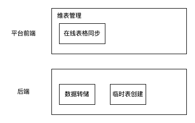
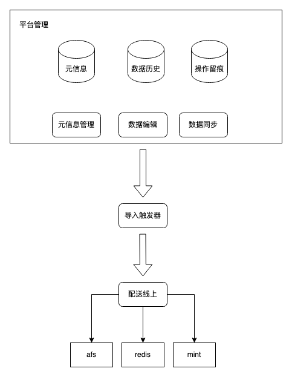
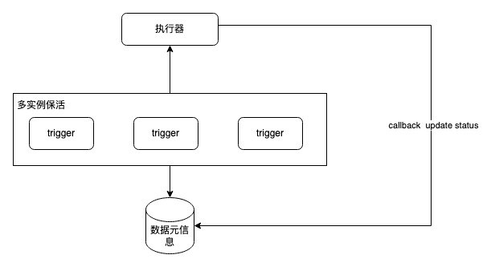

维表管理

## 维表管理

平台基础功能：

1、支持多种类型的维表管理类型，先支持表格型，看后续是否有其他类型

2、支持历史版本管理，diff查看，数据回滚

3、数据同步机制可定制，自定义生效时间（版本切换时间），平台展示数据同步历史

4、元信息管理，分类，检索

5、提醒功能：更新提醒，如更新时间delay通知，数据变动通知

其他设想功能：

1、与图灵打通，创建临时表？图灵表数据导入

2、全量 & 增量同步管理，触发式更新

3、redis 同步管理（tds不支持），实时场景强依赖

4、跨平台同步能力：业务平台相关能力打通

5、元信息管理 --> 通用指标计算 & 导出

6、数据任务血缘图管理：自主编辑 & 可定位到对应tds任务 / turing / afs / ftp，任务全链路可视化，大幅度降低业务流程理解成本

7、schema 管理：维表schema & proto

8、数据口径 & 权限管理

### 详细设计
整体流程

#### 功能设计
维表导入分为维表数据编辑，以及离线数据导入部分两个阶段。两个部分为了支持后续的扩展性，每个阶段设计如下

##### 维表编辑
|功能点|支持功能|备注|
|-|-|-|
|数据来源|1、在线表格编辑2、外部数据源自动同步支持外部数据源扩展|外部数据源可以单独|
|文本编辑模式|针对存储来划分，而不是实际展示的单行与多行单行文本：内部存储成一个大json，每次都是全量更新，适用于存储量没那么大的场景多行文本：每行记录存储成一条，用于存储量巨大的场景，支持增量更新|针对多行文本的实现思路：mysql单表存储在100w行，可以预先准备几张表，在维表创建的时候根据数据量的预估大小选择一个合适的表来存储|
|数据校检|支持针对数据的json schema校检||

##### 基础功能
|功能点|支持功能|备注|
|-|-|-|
|权限管理|支持维表的编辑/只读权限|前期可以先不做..|
||||

##### 辅助功能
|功能点|支持功能|备注|
|-|-|-|
|数据版本|存储数据历史版本，在词基础上支持diff查看，以及数据回滚||
|操作留痕|类似于系统内的消息中心1、数据编辑留痕2、配送留痕3、通知留痕||
|通知功能|1、数据变动提醒2、数据异常未更新报警||
|检索能力|支持针对维表的多维度检索，应对维表较多的场景，前期可以简单的mysql本身的检索，后续接入ES应用各种复杂查询||
|便捷导入|支持诸如excel，csv等文件的全量 or 增量导入功能||

##### 离线导入
|功能点|支持功能|备注|
|-|-|-|
|数据同步|支持针对外部数据源的同步|比如接入运营平台 or 开屏平台|
|数据配送|将数据导入到离线的维表中1、支持多形式的触发（手动触发，定时触发）2、尽可能减少线上数据切换的影响||

#### 存储设计
**数据元信息**

|字段|类型|属性|含义|
|-|-|-|-|
|id|bigint|AI||
|name|varchar|UNIQUE|词典英文名称|
|chname|varchar||Chinese name中文名称|
|schema|varchar||数据schema|
|target_type|varchar||目标类型默认是afs|
|target_params|varchar||目标存储的参数配置，比如如果是afs，则是目标路径，ugi等|
|dtype|int||data type词表类型1、单行文本2、多行文本|
|multi_table|varchar||多行文本分配的表名|
|stype|int||source type词表数据来源1、表格管理2、外部系统|
|adaptor|varchar||外部系统适配器名称1、活动运营平台2、知识库表格|
|adaptor_params|varhcar||适配器参数|
|adaptor_trigger_params|varchar||适配器运行参数，决定了多久触发一次|
|trigger_type|varchar||触发配送方式：manual：手动periodic：周期触发|
|trigger_params|string||触发参数|
|version|int||当前数据版本|
|status|int||词表状态用于后续创建词表的审核流程，先预留了|
|creator|varchar||创建人|
|create_time|timestamp||创建时间|
|update_time|timestamp||更新时间|

**数据历史（针对单行文本）**

|字段|类型|属性|含义|
|-|-|-|-|
|id|bigint|AI||
|did|bigint||对应数据ID|
|version|int||版本|
|data_sign|varchar||数据的唯一sign，用于方便比较数据变更|
|content|text||对应的文本内容|
|creator|varchar||创建人|
|create_time|timstamp||创建时间|
|update_time|timestamp||更新时间|
|||||

**操作留痕**

|字段|类型|属性|含义|
|-|-|-|-|
|id|bigint|AI||
|event_type|varchar||留痕类型1、创建维表2、编辑数据3、数据同步4、自动数据配送5、手动触发配送|
|content|varchar||记录事件的详细信息|
|creator|varchar||触发人，特殊的有几个系统角色system_delivery：系统配送器system_syncer: 系统同步器|
|debug_level|int||为了方便的记录一些系统日志，通过debug_level限制留痕日志的展示层级，用于系统管理员查看更详细的信息|
|create_time|timestamp||创建时间|
|update_time|timestamp||更新时间|

#### 离线设计

#### 实现方式
* 自定义数据平台 + vslambda（不推荐）

    1. 依赖于运营平台，不利用数据管理平台整体生态扩大
    2. 功能上不完全匹配，自定义数据平台是提供了通用的数据编辑在线生效流量，对于数仓建设离线数据管理不太匹配

* elemenui + vue + go restful framework（计划采用）
    * 全新的平台，可以独立形成生态，后续的数据价值都可以通过平台来外扩

